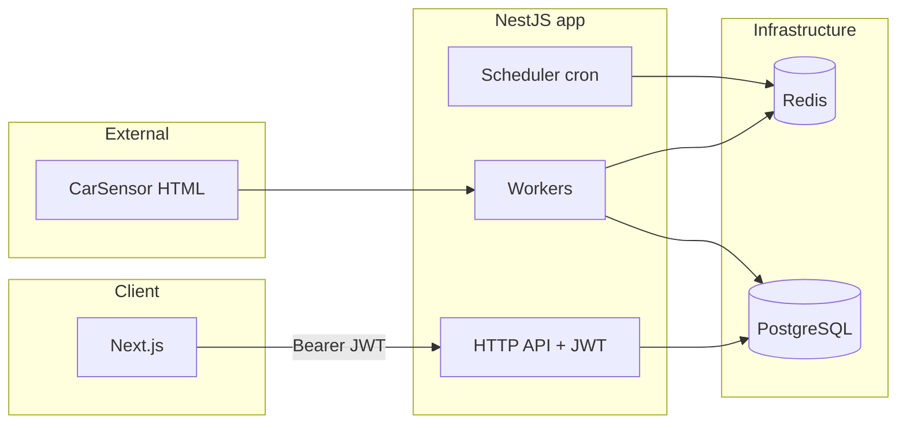

# Carfinder

Carfinder is a full-stack demo that scrapes used-car listings from [CarSensor](https://www.carsensor.net/), stores them in PostgreSQL, and exposes them through a JWT-protected REST API and a responsive Next.js catalog.

It was built as a technical assignment covering **web scraping**, **background jobs**, **a small backend with auth**, and **a frontend for browsing inventory**.

## What’s included

| Area | Implementation |
|------|------------------|
| **Scraping** | NestJS worker + [Cheerio](https://cheerio.js.org/) parsing of listing HTML; hourly schedule via cron; BullMQ for parallel page jobs; retries and run/job tracking in the database |
| **Data** | Prisma + PostgreSQL; idempotent upserts by listing URL; optional “soft” availability when listings disappear across runs |
| **API** | `POST /auth/login`, `GET /auth/me`, `GET /cars` (filters, sort, pagination), `GET /cars/:id` — all car routes require JWT |
| **Frontend** | Next.js (App Router), React Query, Tailwind; login, catalog, and per-car detail pages |
| **JP → display** | Backend normalizes numbers (e.g. 万円, km); frontend adds a small dictionary layer for labels and friendly fields |

## Tech stack

- **Runtime:** Node.js 20+
- **Backend:** NestJS, Prisma, BullMQ, `@nestjs/schedule`, Passport JWT, Bull Board (queue UI)
- **Scraping:** Axios + Cheerio
- **Data:** PostgreSQL 16, Redis 7 (queue broker)
- **Frontend:** Next.js 16, React 19, TanStack Query, Tailwind CSS 4

## Architecture

At a high level, one NestJS process runs the HTTP API, the scrape scheduler, and BullMQ workers. Redis holds job queues; PostgreSQL holds cars, users, and scrape run metadata.



**Design choices (short):**

- **BullMQ + Redis:** Decouples “discover N listing pages” from processing so failures can retry per page without blocking the whole run.
- **Prisma:** Type-safe access and straightforward migrations/schema evolution for cars and scrape bookkeeping.
- **JWT:** Stateless auth suitable for a small API + SPA; credentials are validated against hashed passwords in Postgres.
- **Next.js + React Query:** Server-friendly routing, client-side caching/refetch for snappy catalog navigation after login.
- **CORS:** The API enables CORS for a fixed production frontend origin. For **local** development, add your frontend origin (e.g. `http://localhost:3001`) to the `origin` array in `backend/src/main.ts` if the browser blocks requests.

## Repository layout

```
carfinder/
  docker-compose.yml    # PostgreSQL + Redis (run from repo root)
  backend/              # NestJS API, scraper, Prisma schema, Dockerfile
  frontend/             # Next.js app
```

## Prerequisites

- **Node.js 20+**
- **Docker** and **Docker Compose** (recommended for Postgres + Redis)

## Local installation

### 1. Clone and infrastructure env

From the repository root:

```bash
cp .env.example .env
```

Edit `.env` and set strong values for `POSTGRES_PASSWORD` and `REDIS_PASSWORD`.

### 2. Start Postgres and Redis

```bash
docker compose up -d
```

Default mapped ports (see `docker-compose.yml`):

- PostgreSQL: `127.0.0.1:5434` → container `5432`
- Redis: `127.0.0.1:6380` → container `6379`

### 3. Backend env and database

```bash
cd backend
cp .env.example .env
```

Align `DATABASE_URL` and `REDIS_URL` with the passwords and ports from the root `.env`. Set a strong `JWT_SECRET`.

Then:

```bash
npm install
npm run db:setup
npm run prisma:seed
```

The seed creates the demo user **`admin`** / **`admin123`** (change or remove in production).

### 4. Run the backend

```bash
npm run start
```

- HTTP API defaults to **port 3000** (`APP_PORT` in `backend/.env`).
- Scraper schedule defaults to **once per hour** (`SCRAPE_CRON`, e.g. `0 * * * *`).
- **Bull Board** (queue dashboard): `http://localhost:3000/admin/queues` (path from `BULL_BOARD_PATH`).

### 5. Run the frontend

In another terminal:

```bash
cd frontend
cp .env.example .env.local
npm install
npm run dev
```

Set `NEXT_PUBLIC_API_URL` to your API base (default `http://localhost:3000`). If port 3000 is taken by the API, run the Next dev server on another port, e.g.:

```bash
npm run dev -- --port 3001
```

Open the app (e.g. `http://localhost:3001`), log in, then browse `/cars` and `/cars/[id]`.

## Environment variables (overview)

| Location | Purpose |
|----------|---------|
| **Root `.env`** | `POSTGRES_*`, `REDIS_PASSWORD` for Docker Compose |
| **`backend/.env`** | `DATABASE_URL`, `REDIS_URL`, `JWT_SECRET`, `SCRAPE_CRON`, queue/worker tuning, `APP_PORT`, `BULL_BOARD_PATH`, feature flags such as `ENABLE_JOBS` |
| **`frontend/.env.local`** | `NEXT_PUBLIC_API_URL`, optional `NEXT_PUBLIC_JPY_TO_EUR_RATE` (primary display) plus optional `NEXT_PUBLIC_JPY_TO_USD_RATE`, `NEXT_PUBLIC_JPY_TO_GBP_RATE`, `NEXT_PUBLIC_JPY_TO_RUB_RATE` |

Full lists and scraper notes: [`backend/README.md`](backend/README.md). Frontend-specific notes: [`frontend/README.md`](frontend/README.md).

## API summary

| Method | Path | Auth | Description |
|--------|------|------|-------------|
| `POST` | `/auth/login` | No | Body: `{ "username", "password" }` → JWT |
| `GET` | `/auth/me` | Bearer JWT | Current user |
| `GET` | `/cars` | Bearer JWT | Query: brand, year range, price/mileage range, `isAvailable`, `page`, `limit`, `sortBy`, `sortOrder` |
| `GET` | `/cars/:id` | Bearer JWT | Single car with details |

Protected routes expect: `Authorization: Bearer <token>`.

## Scraping and Japanese data

- Listings are parsed from CarSensor HTML; **brand, model, year, mileage, price, photos**, and raw fragments are stored. Numeric strings in Japanese (e.g. **万円**, **km**) are normalized in the backend (`normalizers`).
- A **dictionary / mapping layer** on the frontend (`frontend/src/lib/dictionary/`) improves English-facing labels and presentation without requiring a full translation service.

## Production build

- **Backend:** multi-stage [`backend/Dockerfile`](backend/Dockerfile) — build with Prisma generate + `tsc`, run with `npm run start:prod`.
- **Frontend:** `cd frontend && npm run build && npm run start` (or deploy to Vercel/Netlify with `frontend/` as the app root).

Set environment variables in your host’s secret UI; never commit real secrets.

## Submission checklist (typical assignment handoff)

- **Source code:** this repository (GitHub / GitLab / etc.).
- **Deployed app:** [https://carfinder-eta.vercel.app/](https://carfinder-eta.vercel.app/). 

---

For day-to-day backend commands, scraper tuning, and env details, see [`backend/README.md`](backend/README.md). For UI routes and frontend env, see [`frontend/README.md`](frontend/README.md).
